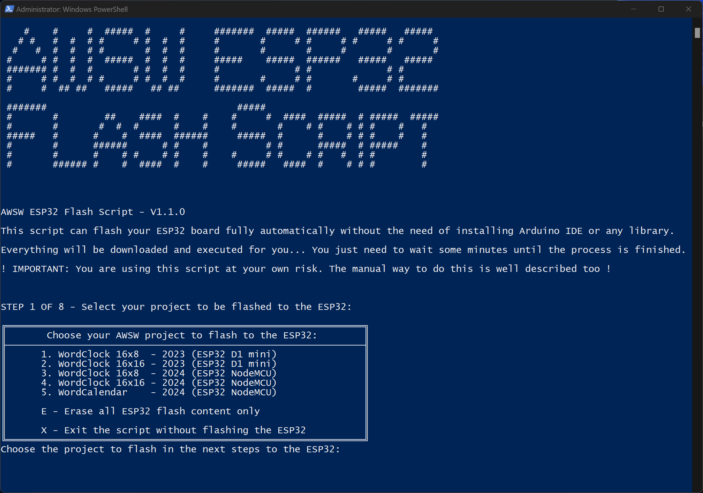

# AWSW-ESP32-flash-script

AWSW ESP32 flash script

This script can flash your ESP32 board fully automatically without the need of installing Arduino IDE or any library.

You will find a script for MS Windows 10/11 and thanks a lot to @johnneerdael for adding a variant of this script for the usage in macOS. =)

Everything will be downloaded and executed for you... You just need to wait some minutes until the process is finished.

Please watch this video that shows the usage and the process to add the device to your WiFi: https://youtu.be/oiCbp8OFSus

!!! IMPORTANT: You are using this script at your own risk !!!
